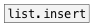

[<<< reference home](ceammc_lib.md)
---

# list.remove

```


[1 2 3 4 5 6(      [\(a b c d e\), bang(
|                  |
|  [list A B C D(  [ml]
|  |               |
|  |           [F] |
|  |           |.  |
[list.remove 0 -1  ]
|
[ui.display @display_type=1]

            
```
---
on input list remove element(s) at specified positions
---
arguments:

INDEXES: list of indexes to remove. Negative indexes are
            also supported<br>

---
properties:


---
see also:<br>
[](list.insert.md)
