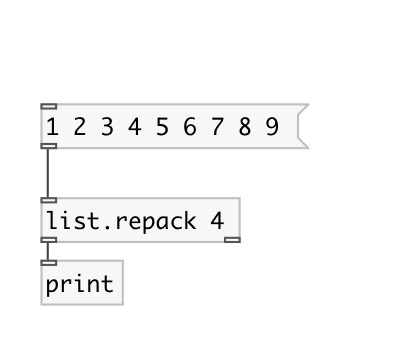

[index](index.html) :: [list](category_list.html)
---

# list.repack

###### repack list to specified size

*available since version:* 0.1

---

## arguments:

* **SIZE**
output list size 
_type:_ int 

## properties:

* **@size** 
Get/set output list size 
_type:_ int 
_range:_ 1..1024 
_default:_ 1 

## inlets:

* input list 
_type:_ control

## outlets:

* output list 
_type:_ control
* bang after last element output 
_type:_ control

## keywords:

[list](keywords/list.html)
[repack](keywords/repack.html)

**Authors:** Serge Poltavsky

**License:** GPL3 or later

