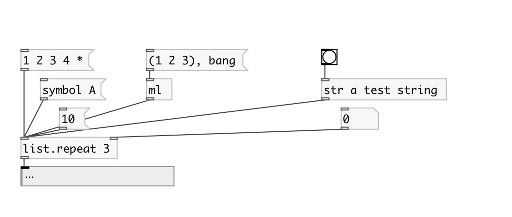

[< reference home](index.html)
---

# list.repeat

creates new list by repeating given list specified times

---

 

---

---
arguments:

N: repeat times 

---
properties:

@times: repeat
            times 

