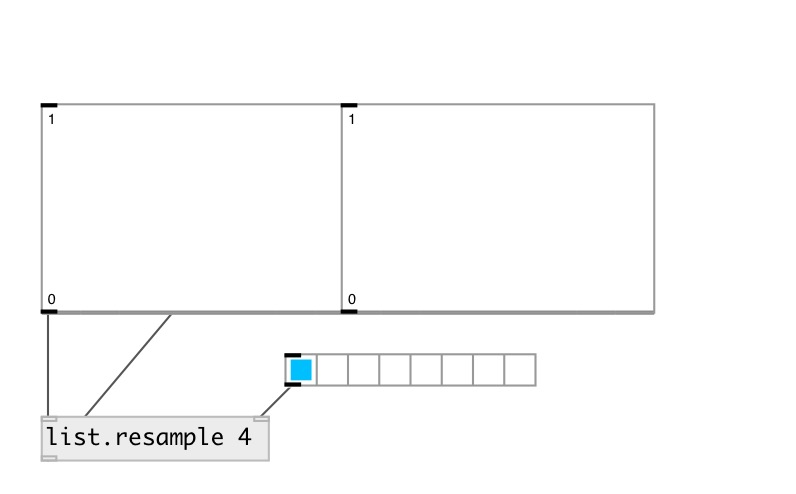

[index](index.html) :: [list](category_list.html)
---

# list.resample

###### resample list with specified ratio

*available since version:* 0.9

---

## arguments:

* **RATIO**
resample ratio 
__type:__ float 

## properties:

* **@ratio** 
Get/set resample ratio (src/dest) 
__type:__ float 
__range:__ 0..100 
__default:__ 1 

## inlets:

* input list. 
__type:__ control 
* set ratio 
__type:__ control 

## outlets:

* new modified list
__type:__ control 

## keywords:

[list](keywords/list.html)

**See also:**
[\[list.stretch\]](list.stretch.html)

**Authors:** Serge Poltavsky

**License:** GPL3 or later

