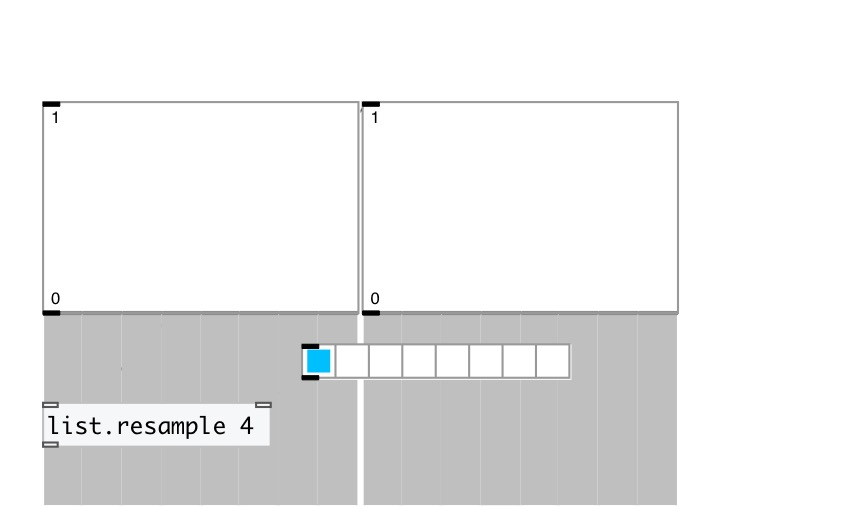

[< reference home](index.html)
---

# list.resample

resample list with specified ratio

---

 

---

---
arguments:

RATIO: resample
            ratio 

---
properties:

@ratio: resample
            ratio (src/dest) 

---
see also: 

