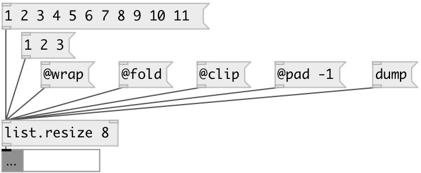

[index](index.html) :: [list](category_list.html)
---

# list.resize

###### changes list size

*available since version:* 0.1

---

## arguments:

* **SIZE**
desired list size 
_type:_ int 

## properties:

* **@size** 
Get/set output list size 
_type:_ int 
_min value:_ 0 
_default:_ 0 

* **@method** 
Get/set method of resizing, if new size is longer then current 
_type:_ symbol 
_enum:_ pad, clip, wrap, fold 
_default:_ pad 

* **@pad** 
Get/set pad value for pad method of resizing 
_type:_ atom 
_default:_ 0 

* **@clip** 
Get/set alias for @method clip 
_type:_ alias 

* **@wrap** 
Get/set alias for @method wrap 
_type:_ alias 

* **@fold** 
Get/set alias for @method fold 
_type:_ alias 

## inlets:

* input list 
_type:_ control

## outlets:

* resized list 
_type:_ control

## keywords:

[list](keywords/list.html)
[size](keywords/size.html)
[resize](keywords/resize.html)

**See also:**
[\[list.length\]](list.length.html)

**Authors:** Serge Poltavsky

**License:** GPL3 or later

