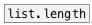

[< reference home](ceammc_lib.html)
---

# list.resize


changes list size

```


[1 2 3 4 5 6 7 8 9 10 11(
|
| [1 2 3(
| |
| | [@wrap( [@fold( [@clip( [@pad -1( [dump(
| | |       |       |       |         |
| | |       |       |       |         |
| | |       |       |       |         |
[list.resize                          8]
|
[msg set]
|
[ (

            
```

---
arguments:

SIZE: desired list size<br>

---
properties:

@size: output list size<br>
@method: method
            of resizing, if new size is longer then current<br>
@pad: pad value for pad method of
            resizing<br>
@clip: alias for @method clip<br>
@wrap: alias for @method wrap<br>
@fold: alias for @method fold<br>

---
see also:<br>
[](list.length.html)
