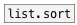
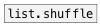

# list.reverse

```


[1 2 3 4 5(  [list a b c d e( [\(5 4 3 2 1\), bang(
|            |                |
|            |                [ml]
|            |                |
[list.reverse                 ]
|
[ui.display @display_type=1]

            
```
---
arguments:


---
properties:


see also:<br>


