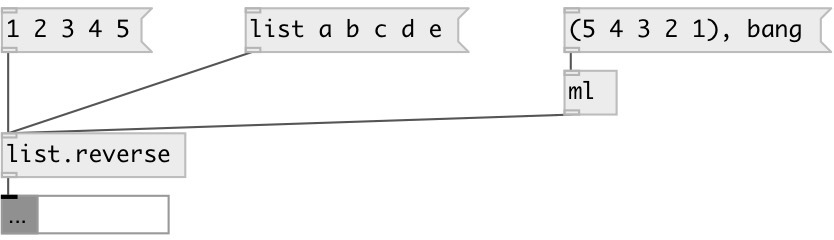

[index](index.html) :: [list](category_list.html)
---

# list.reverse

###### reverses the order of the elements in the list

*available since version:* 0.1

---

## inlets:

* input list 
__type:__ control 

## outlets:

* reversed list
__type:__ control 

## keywords:

[list](keywords/list.html)
[reverse](keywords/reverse.html)

**See also:**
[\[list.sort\]](list.sort.html)
[\[list.shuffle\]](list.shuffle.html)

**Authors:** Serge Poltavsky

**License:** GPL3 or later

