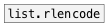

# list.rldecode

```


[1 2 1 3(    [1 3 2 2(
|            |.
[list.unwrap  ]
|
[msg set]
|
[ (

            
```
---
arguments:

LST: initial element repeat list<br>

---
properties:


see also:<br>

