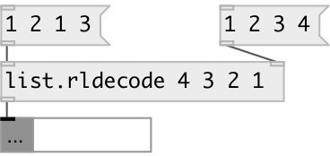

[index](index.html) :: [list](category_list.html)
---

# list.rldecode

###### Run-length list decoder (RLE)

*available since version:* 0.1

---

## arguments:

* **LST**
initial element repeat list 
__type:__ list 

## properties:

* **@l** 
Get/set list of repeats 
__type:__ list 

## inlets:

* First list - single elements 
__type:__ control 
* Second list - count of each element 
__type:__ control 

## outlets:

* result - elements repeated n times specified by corresponding values in second
            list
__type:__ control 

## keywords:

[list](keywords/list.html)
[rle](keywords/rle.html)
[decode](keywords/decode.html)

**See also:**
[\[list.rlencode\]](list.rlencode.html)

**Authors:** Alex Nadzharov, Serge Poltavsky

**License:** GPL3 or later

