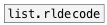

[< reference home](index.html)
---

# list.rlencode


RLE (run-length encoding) for lists

---

<br>


---


```


[1 1 2 2 2 1 3(
|
[list.rlencode  ]
|              ^|
[msg set]      [msg set]
|              |
[ (            [ (

            
```

---
arguments:


---
properties:


---
see also:<br>
[](list.rldecode.html)
