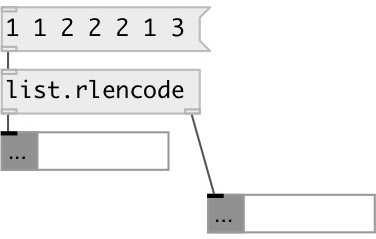

[index](index.html) :: [list](category_list.html)
---

# list.rlencode

###### RLE (run-length encoding) for lists

*available since version:* 0.1

---

## inlets:

* input list 
__type:__ control 

## outlets:

* First list: list entries without repetitions. For example 1 1 2 2 2 1 1 becomes
            1 2 1
__type:__ control 
* Second list: count of entries
__type:__ control 

## keywords:

[list](keywords/list.html)
[functional](keywords/functional.html)

**See also:**
[\[list.rldecode\]](list.rldecode.html)

**Authors:** Alex Nadzharov, Serge Poltavsky

**License:** GPL3 or later

