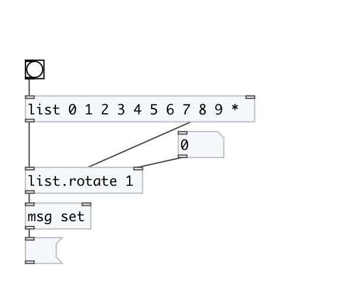

[< reference home](index.html)
---

# list.rotate

rotates list

---

[list.rotate] and [list.&lt;&lt;] rotate list left. [list.&gt;&gt; rotates
            right.
 

---

---
arguments:

STEP: rotate step. Negative step changes rotation
            direction 

---
properties:

@step: rotate step. Negative value change
            rotation direction to opposite 

---
see also: 

