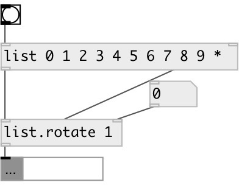

[index](index.html) :: [list](category_list.html)
---

# list.rotate
**aliases:** [list.&gt;]

###### rotates list

*available since version:* 0.1

---

## information
[list.rotate] and [list.&gt; rotates right.

## arguments:

* **STEP**
rotate step. Negative step changes rotation direction 
_type:_ int 

## properties:

* **@step** 
Get/set rotate step. Negative value change rotation direction to opposite 
_type:_ int 
_default:_ 1 

## inlets:

* input list 
_type:_ control
* rotation step 
_type:_ control

## outlets:

* rotated list 
_type:_ control

## keywords:

[list](keywords/list.html)
[rotate](keywords/rotate.html)

**See also:**
[\[list.choice\]](list.choice.html)

**Authors:** Serge Poltavsky

**License:** GPL3 or later

