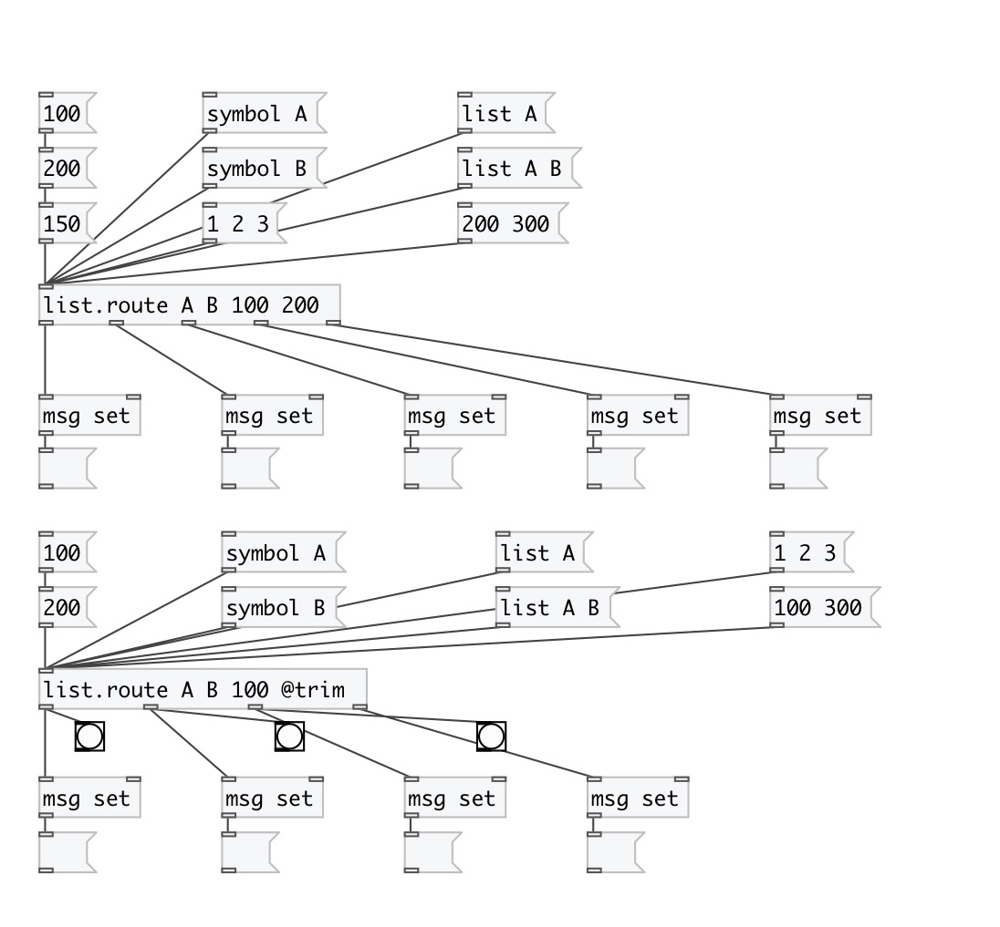

[< reference home](index.html)
---

# list.route

acts like [route] but for lists

---

Outputs float, symbol or list to matched outlet or to last outlet if no
            match
 

---

---
arguments:

@type: list of matched atoms 

---
properties:

@trim: cut first element from list, transform float or
            symbol to bang 
@simplify: one element list
            simplification - transform them to floats or symbols 
@as_any: trim list or symbol selector on output. 

---
see also: 

