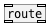

[< reference home](ceammc_lib.html)
---

# list.route


acts like [route] but for lists

---

Outputs float, symbol or list to matched outlet or to last outlet if no
            match<br>


---


```


[100 #x( [symbol A #a( [list A #d(

[200 #y( [symbol B #b( [list A B #e(

[150 #z( [1 2 3 #c(    [200 300 #f(


[list.route A B 100 200              #r     ]
|         ^|        ^^|       ^^^|      ^^^^|
|          |          |          |          |
|          |          |          |          |
[msg set] [msg set] [msg set] [msg set] [msg set]
|         |         |         |         |
[ (       [ (       [ (       [ (       [ (


[100 #x2( [symbol A #a2( [list A #d2(   [1 2 3 #c2(

[200 #y2( [symbol B #b2( [list A B #e2( [100 300 #f2(


[list.route A B 100  @trim               #r2]
| |       ^| ^|     ^^| ^^|   ^^^|
| [B]      | [B]      | [B]      |
|          |          |          |
[msg set] [msg set] [msg set] [msg set]
|         |         |         |
[ (       [ (       [ (       [ (

[X a->r]
[X b->r]
[X c->r]
[X d->r]
[X e->r]
[X f->r]
[X x->r]
[X y->r]
[X z->r]
[X a2->r2]
[X b2->r2]
[X c2->r2]
[X d2->r2]
[X e2->r2]
[X f2->r2]
[X x2->r2]
[X y2->r2]

            
```

---
arguments:

@type: list of matched atoms<br>

---
properties:

@trim: cut first element from list, transform float or
            symbol to bang<br>
@simplify: one element list
            simplification - transform them to floats or symbols<br>
@as_any: trim list or symbol selector on output.<br>

---
see also:<br>
[](route.html)
