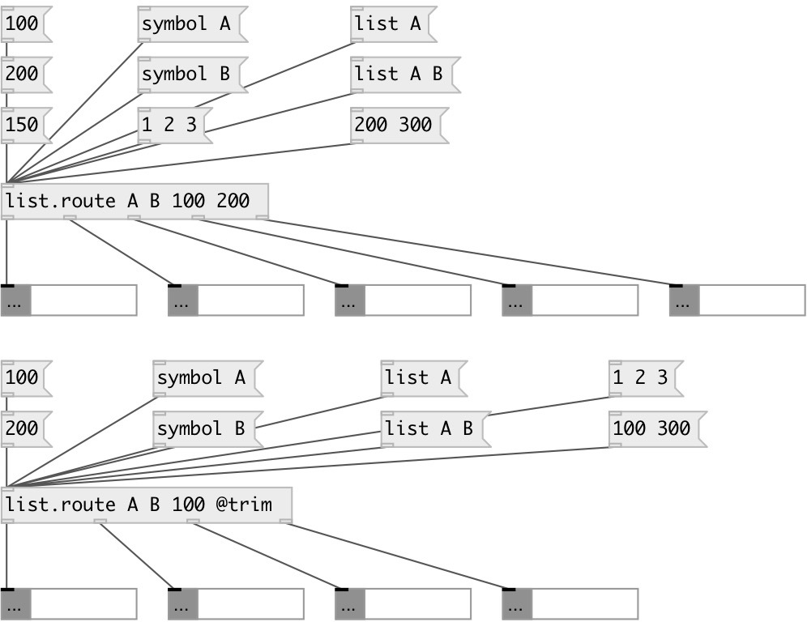

[index](index.html) :: [list](category_list.html)
---

# list.route

###### acts like [route] but for lists

*available since version:* 0.5

---

## information
Outputs float, symbol or list to matched outlet or to last outlet if no
            match

## arguments:

* **@type**
list of matched atoms 
__type:__ list 

## properties:

* **@args** 
Get/set matching atoms 
__type:__ list 

* **@trim** 
Get/set cut first element from list, transform float or symbol to bang 
__type:__ flag 
__default:__ 0 

* **@simplify** 
Get/set one element list simplification - transform them to floats or symbols 
__type:__ int 
__enum:__ 0, 1 
__default:__ 1 

* **@as_any** 
Get/set trim list or symbol selector on output 
__type:__ flag 
__default:__ 0 

## inlets:

* input list 
__type:__ control 

## outlets:

* first match
__type:__ control 
* second match
__type:__ control 
* nth match
__type:__ control 
* unmatched element (without changes)
__type:__ control 

## keywords:

[list](keywords/list.html)
[route](keywords/route.html)

**See also:**
[\[route\]](route.html)

**Authors:** Serge Poltavsky

**License:** GPL3 or later

