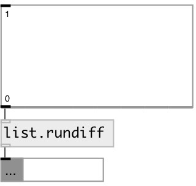

[index](index.html) :: [list](category_list.html)
---

# list.rundiff

###### running difference

*available since version:* 0.9.4

---

## information
Computes the adjacent difference of the elements of the input list • y0 = x0 • y1 = x1 - x0 • y2 = x2 - x1 • y3 = x3 - x2 etc...

## inlets:

* input list 
_type:_ control

## outlets:

* result list 
_type:_ control

## keywords:

[list](keywords/list.html)
[running](keywords/running.html)
[difference](keywords/difference.html)
[partial](keywords/partial.html)
[cumulative](keywords/cumulative.html)

**See also:**
[\[list.runsum\]](list.runsum.html)

**Authors:** Serge Poltavsky

**License:** GPL3 or later

