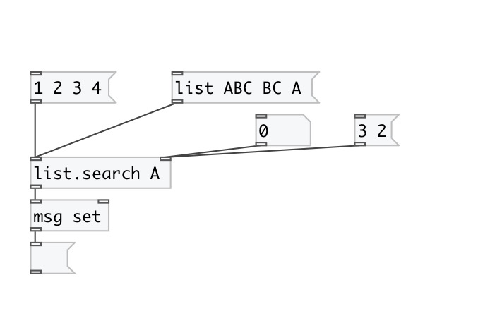
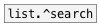

[< reference home](index.html)
---

# list.search

search specified items in input list

---

Returns item position in list or -1 if not found.
If several items are specified returns list of positions.
 

---

---
arguments:

---
properties:

---
see also: 

