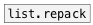
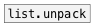

[<<< reference home](ceammc_lib.md)
---

# list.separate

```


[1 2 3 4 5( [\(a b c d e\), bang(
|           |
|           [ml] [_]
|           |    |
|           |    [@enumerate $1(
|           |    |
[list.separate   ]
|
[print SEPARATE]

            
```
---
sends list elements one by one separately
---
arguments:


---
properties:

@enumerate: enumeration mode. If
            enumeration is active output pairs: INDEX ATOM, otherwise single atoms<br>
@from: enumeration starting index<br>

---
see also:<br>
[](list.repack.md)
[](list.unpack.md)
