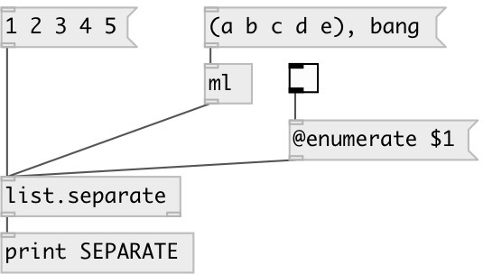

[index](index.html) :: [list](category_list.html)
---

# list.separate
**aliases:** [list.sep]

###### sends list elements one by one separately

*available since version:* 0.3

---

## properties:

* **@enumerate** 
Get/set enumeration mode. If enumeration is active output pairs: INDEX ATOM, otherwise
single atoms 
_type:_ int 
_enum:_ 0, 1 
_default:_ 0 

* **@from** 
Get/set enumeration starting index 
_type:_ int 
_default:_ 0 

## inlets:

* input list 
_type:_ control

## outlets:

* outlet for single atoms (or pair: IDX ATOM in enumeration mode) 
_type:_ control
* outputs bang after last element in the list 
_type:_ control

## keywords:

[list](keywords/list.html)
[separate](keywords/separate.html)

**See also:**
[\[list.repack\]](list.repack.html)
[\[list.unpack\]](list.unpack.html)

**Authors:** Serge Poltavsky

**License:** GPL3 or later

