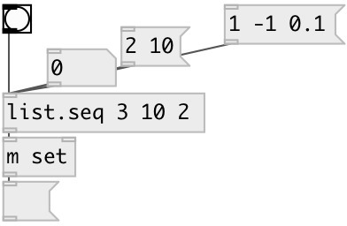

[index](index.html) :: [list](category_list.html)
---

# list.seq

###### numeric sequence list generator

*available since version:* 0.1

---

## arguments:

* **FROM**
start value 
_type:_ float 

* **TO**
end value 
_type:_ float 

* **STEP**
sequence step 
_type:_ float 

## properties:

* **@from** 
Get/set start value 
_type:_ float 
_default:_ 0 

* **@to** 
Get/set end value 
_type:_ float 
_default:_ 1 

* **@step** 
Get/set sequence step (always positive) 
_type:_ float 
_default:_ 1 

* **@closed** 
Get/set generate closed range sequence 
_type:_ flag 
_default:_ 0 

## inlets:

* outputs generated list 
_type:_ control

## outlets:

* generated sequence 
_type:_ control

## keywords:

[list](keywords/list.html)
[sequence](keywords/sequence.html)
[generate](keywords/generate.html)

**See also:**
[\[list.gen\]](list.gen.html)

**Authors:** Alex Nadzharov, Serge Poltavsky

**License:** GPL3 or later

