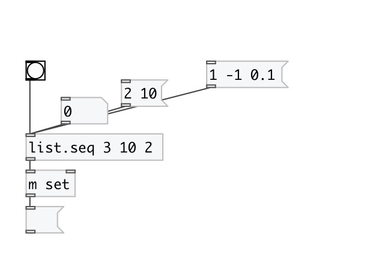

[< reference home](index.html)
---

# list.seq

numeric sequence list generator

---

 

---

---
arguments:

FROM: start value 
TO: end value 
STEP: sequence step 

---
properties:

@from: start value 
@to: end value 
@step: sequence step (always
            positive) 
@closed: generate closed range sequence 

---
see also: 

