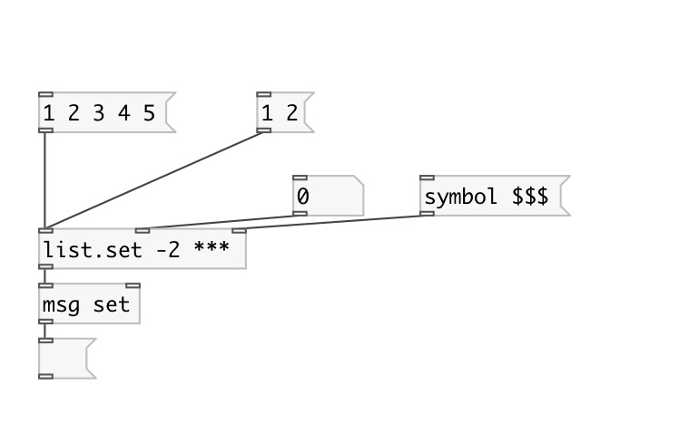

[< reference home](index.html)
---

# list.set

on input list set value at specified position

---

 

---

---
arguments:

IDX: element position. Negative indexes are supported. -1
            means last element 

---
properties:

