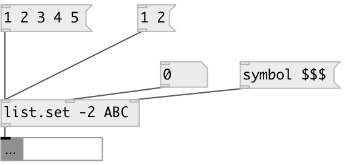

[index](index.html) :: [list](category_list.html)
---

# list.set

###### set list value at specified position

*available since version:* 0.6

---

## arguments:

* **IDX**
element position. Negative indexes are supported. -1 means last element 
__type:__ int 

* **VAL**
element value 
__type:__ atom 

## properties:

* **@index** 
Get/set element index 
__type:__ int 
__default:__ 0 

* **@value** 
Get/set element value 
__type:__ atom 

## inlets:

* input list 
__type:__ control 
* element index 
__type:__ control 
* new element value 
__type:__ control 

## outlets:

* result list
__type:__ control 

## keywords:

[list](keywords/list.html)
[set](keywords/set.html)

**Authors:** Serge Poltavsky

**License:** GPL3 or later

