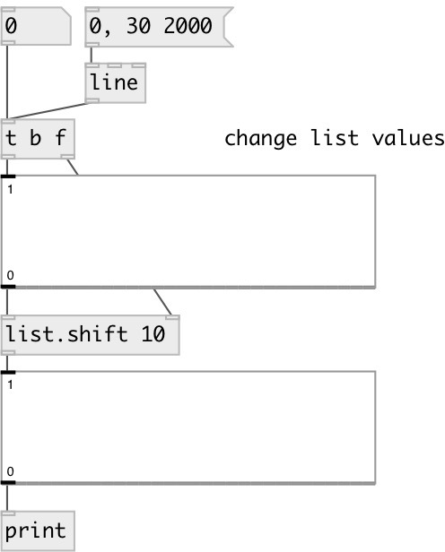

[index](index.html) :: [list](category_list.html)
---

# list.shift

###### shifts the contents of the list with linear interpolation

*available since version:* 0.1

---

## arguments:

* **shift**
shift amount. Float values cause linear interpolation. Can be negative. 
__type:__ float 

## properties:

* **@shift** 
Get/set shift amount 
__type:__ float 
__default:__ 0 

## inlets:

* input list 
__type:__ control 
* shift value 
__type:__ control 

## outlets:

* new modified list
__type:__ control 

## keywords:

[list](keywords/list.html)

**See also:**
[\[list.rotate\]](list.rotate.html)

**Authors:** Alex Nadzharov, Serge Poltavsky

**License:** GPL3 or later

