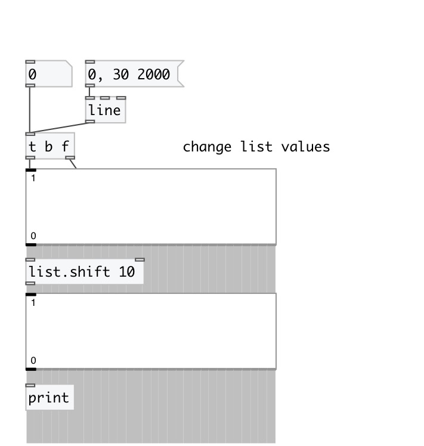
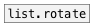

[< reference home](index.html)
---

# list.shift

shifts the contents of the list with linear interpolation

---

 

---

---
arguments:

shift: shift amount. Float values cause linear
            interpolation. Can be negative. 

---
properties:

@shift: shift amount 

---
see also: 

