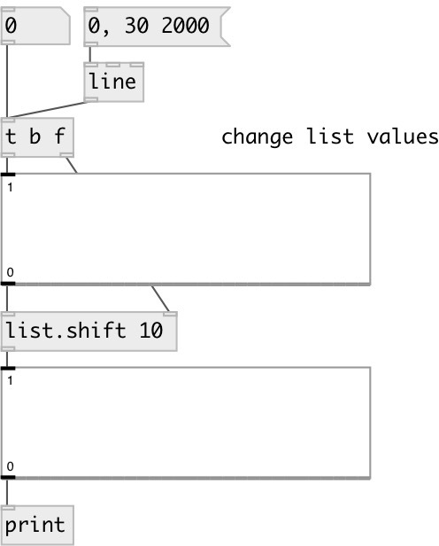

[index](index.html) :: [list](category_list.html)
---

# list.shift

###### cyclic shift of a list by a real number with a linear Interpolation

*available since version:* 0.1

---

## arguments:

* **SHIFT**
shift amount. Float values cause linear interpolation. Can be negative. 
_type:_ float 

## properties:

* **@shift** 
Get/set shift amount 
_type:_ float 
_default:_ 0 

## inlets:

* input list 
_type:_ control
* shift value 
_type:_ control

## outlets:

* new modified list 
_type:_ control

## keywords:

[list](keywords/list.html)

**See also:**
[\[list.rotate\]](list.rotate.html)

**Authors:** Alex Nadzharov, Serge Poltavsky

**License:** GPL3 or later

