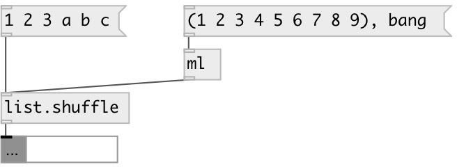

[index](index.html) :: [list](category_list.html)
---

# list.shuffle

###### randomly rearranges elements in list

*available since version:* 0.1

---

## inlets:

* input list 
_type:_ control

## outlets:

* new shuffled list 
_type:_ control

## keywords:

[list](keywords/list.html)
[shuffle](keywords/shuffle.html)
[random](keywords/random.html)

**See also:**
[\[list.sort\]](list.sort.html)
[\[list.reverse\]](list.reverse.html)

**Authors:** Serge Poltavsky

**License:** GPL3 or later

