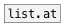

# list.slice

```


[list A B C D E(    [list A B C D E(   [list A B C D E(
|                   |                  |
[list.slice 2]      [list.slice 2 4]   [list.slice 0 5 2]
|                   |                  |
[msg set]           [msg set]          [msg set]
|                   |                  |
[ (                 [ (                [ (

[list A B C D E(    [list A B C D E(
|                   |
[list.slice -2]     [list.slice -4 -1]
|                   |
[msg set]           [msg set]
|                   |
[ (                 [ (

            
```
---
arguments:

FROM: @from property<br>
TO: @to property<br>
STEP: @step property<br>

---
properties:

@from: start slice position. You can use
            negative index to address elements from the end<br>
@to: end slice position. You can use negative
            index to address elements from the end<br>
@step: slice step<br>

see also:<br>

