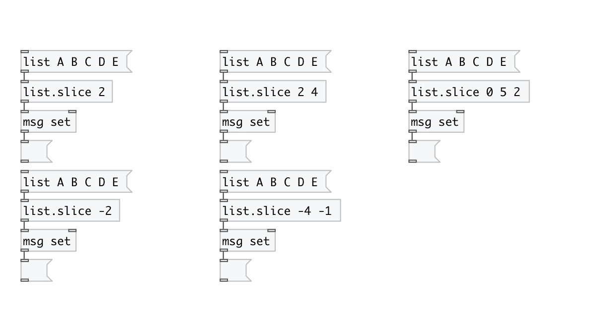

[< reference home](index.html)
---

# list.slice

extract sublist

---

 

---

---
arguments:

FROM: @from property 
TO: @to property 
STEP: @step property 

---
properties:

@from: start slice position. You can use
            negative index to address elements from the end 
@to: end slice position. You can use negative
            index to address elements from the end 
@step: slice step 

---
see also: 

