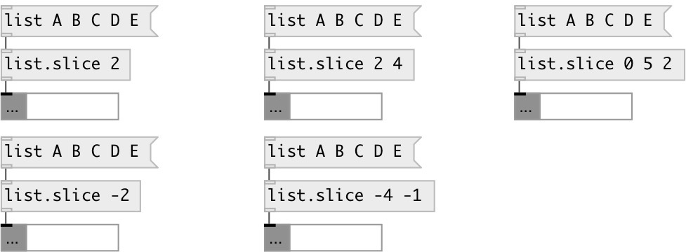

[index](index.html) :: [list](category_list.html)
---

# list.slice

###### extract sublist

*available since version:* 0.2

---

## arguments:

* **FROM**
@from property 
__type:__ int 

* **TO**
@to property 
__type:__ int 

* **STEP**
@step property 
__type:__ int 

## properties:

* **@from** 
Get/set start slice position. You can use negative index to address elements from the
end 
__type:__ int 
__default:__ 0 

* **@to** 
Get/set end slice position. You can use negative index to address elements from the end 
__type:__ int 
__default:__ -1 

* **@step** 
Get/set slice step 
__type:__ int 
__min value:__ 0 
__default:__ 1 

## inlets:

* input list 
__type:__ control 

## outlets:

* output sublist
__type:__ control 

## keywords:

[list](keywords/list.html)
[slice](keywords/slice.html)
[sublist](keywords/sublist.html)

**See also:**
[\[list.at\]](list.at.html)

**Authors:** Serge Poltavsky

**License:** GPL3 or later

