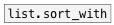

[< reference home](ceammc_lib.html)
---

# list.sort


sorts list values by ascending order

```


[2 -2 4 1 2.0( [1 a -2 b 4 1 2.0(
|              |
[list.sort     ]
|
[msg set]
|
[ (
                
            
```

---
arguments:


---
properties:


---
see also:<br>
[](list.sort_with.html)
[](list.reverse.html)
[](list.shuffle.html)
