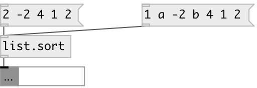

[index](index.html) :: [list](category_list.html)
---

# list.sort

###### sorts list values by ascending order

*available since version:* 0.1

---

## inlets:

* Input list. 
__type:__ control 

## outlets:

* new sorted list
__type:__ control 

## keywords:

[list](keywords/list.html)
[sort](keywords/sort.html)

**See also:**
[\[list.sort_with\]](list.sort_with.html)
[\[list.reverse\]](list.reverse.html)
[\[list.shuffle\]](list.shuffle.html)

**Authors:** Serge Poltavsky

**License:** GPL3 or later

