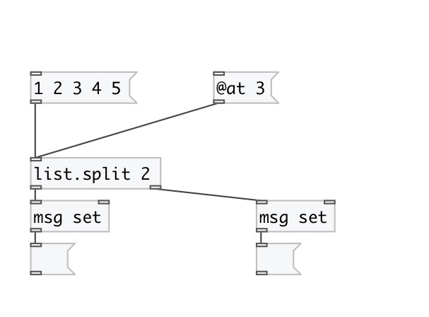

[< reference home](index.html)
---

# list.split

splits list into two parts, the length of first list is specified by the
            argument.

---

 

---

---
arguments:

AT: size of first list. The size of the list on the second
            output is the size of input list - this value 

---
properties:

@at: split point 

---
see also: 

