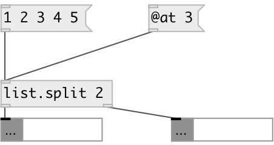

[index](index.html) :: [list](category_list.html)
---

# list.split

###### splits list into two parts, the length of first list is specified by the
            argument

*available since version:* 0.1

---

## arguments:

* **AT**
size of first list. The size of the list on the second output is the size of
input list - this value 
__type:__ int 

## properties:

* **@at** 
Get/set split point 
__type:__ int 
__min value:__ 0 
__default:__ 0 

## inlets:

* input list 
__type:__ control 

## outlets:

* first sub-list of given size
__type:__ control 
* second sub-list
__type:__ control 

## keywords:

[list](keywords/list.html)
[split](keywords/split.html)
[moses](keywords/moses.html)

**See also:**
[\[list.at\]](list.at.html)

**Authors:** Alex Nadzharov, Serge Poltavsky

**License:** GPL3 or later

