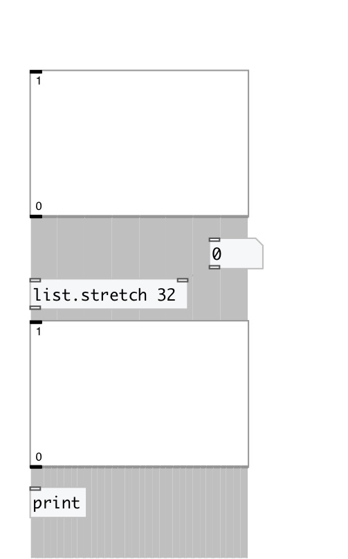

[< reference home](index.html)
---

# list.stretch

stretches list - changes its size with linear interpolation

---

 

---

---
arguments:

stretch: New size of output list. Input list
            will be stretched to the new size with linear interpolation 

---
properties:

@size: new size 

---
see also: 

