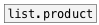
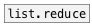

[<<< reference home](ceammc_lib.md)
---

# list.sum

```


[1 2 3 a b -1.1( [list a b c(
|                |
[list.sum        ]
|
[F]

            
```
---
calculates sum of floats in list
---
arguments:


---
properties:


---
see also:<br>
[](list.product.md)
[](list.reduce.md)
