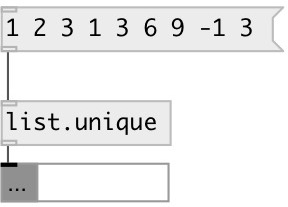

[index](index.html) :: [list](category_list.html)
---

# list.unique

###### removes duplicates from input list

*available since version:* 0.1

---

## properties:

* **@stable** 
Get/set if true - preserves element appearing order 
_type:_ bool 
_default:_ 1 

## inlets:

* input list 
_type:_ control

## outlets:

* output list 
_type:_ control

## keywords:

[list](keywords/list.html)
[unique](keywords/unique.html)
[sort](keywords/sort.html)

**See also:**
[\[list.sort\]](list.sort.html)

**Authors:** Serge Poltavsky

**License:** GPL3 or later

