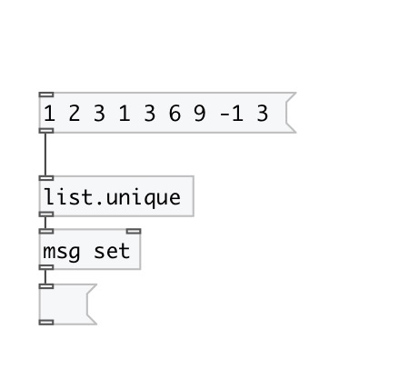

[< reference home](index.html)
---

# list.unique

removes duplicates from input list

---

 

---

---
arguments:

---
properties:

@stable: if true - preserves element
            appearing order 

---
see also: 

