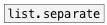

[< reference home](ceammc_lib.html)
---

# list.unpack


unpack list elements to separate outlets

```


[1 2 3 4 5 6( [3 4(
|             |
[list.unpack 3]
|     ^|    ^^|
[F]   [F]    [F]

            
```

---
arguments:

N: number of outlets<br>

---
properties:


---
see also:<br>
[](list.repack.html)
[](list.separate.html)
