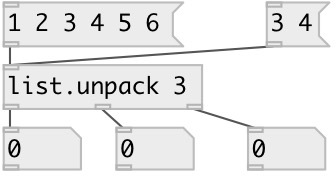

[index](index.html) :: [list](category_list.html)
---

# list.unpack

###### unpack list elements to separate outlets

*available since version:* 0.3

---

## arguments:

* **N**
number of outlets 
__type:__ int 

## inlets:

* input list 
__type:__ control 

## outlets:

* outlet for first atom in list
__type:__ control 
* None
__type:__ control 
* outlet for Nth atom in list
__type:__ control 

## keywords:

[list](keywords/list.html)
[unpack](keywords/unpack.html)

**See also:**
[\[list.repack\]](list.repack.html)
[\[list.separate\]](list.separate.html)

**Authors:** Serge Poltavsky

**License:** GPL3 or later

