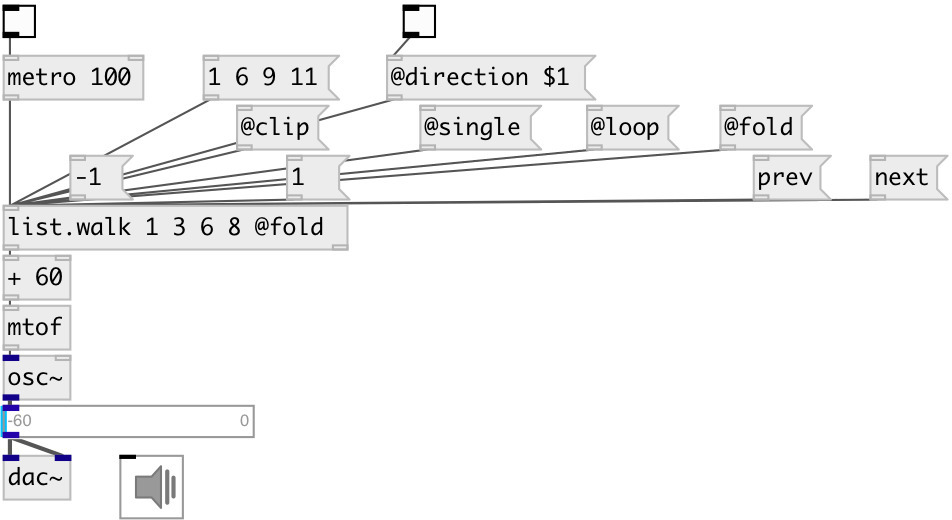

[index](index.html) :: [list](category_list.html)
---

# list.walk

###### Walks thru the list

*available since version:* 0.1

---

## information
Universal list walker. If you want to output current element and when move to next
            - use [1( message, Otherwise - use [next( if you want first move to next position and
            then output it.

## arguments:

* **INIT**
initial list 
__type:__ list 

## methods:

* **current**
outputs current element 

* **dump**
dump internal object state to Pd console window 

* **next**
 
  __parameters:__
  - **[STEP=1]** moves to next element with optional given step and outputs it 
    type: int  

* **prev**
 
  __parameters:__
  - **[STEP=1]** moves to previous element with optional given step and outputs it 
    type: int  

* **reset**
sets current position to 0 

## properties:

* **@mode** 
Get/set pass mode. See properties below for detailed information. 
__type:__ symbol 
__enum:__ single, clip, wrap, fold 
__default:__ single 

* **@clip** 
Get/set clipped pass mode. When the list bounds are reached - min/max value repeats
perpetually. 
__type:__ alias 

* **@single** 
Get/set single pass mode. When the list bounds are reached - no output any more until
reset. 
__type:__ alias 

* **@loop** 
Get/set @wrap alias 
__type:__ alias 

* **@wrap** 
Get/set wrap pass mode. List values are repeated in a loop 
__type:__ alias 

* **@fold** 
Get/set fold pass mode. List values are repeated in a loop with folding 
__type:__ alias 

* **@direction** 
Get/set walking direction. &#34;1&#34; - forwards, &#34;0&#34; - backwards. 
__type:__ int 
__enum:__ 0, 1 
__default:__ 1 

* **@index** 
Get/set current position 
__type:__ list 
__min value:__ 0 
__default:__ 0 

* **@length** 
Get/set output list length 
__type:__ int 
__min value:__ 1 
__default:__ 1 

* **@size** (readonly)
Get current list size 
__type:__ int 
__min value:__ 0 
__default:__ 0 

* **@value** 
Get/set current list 
__type:__ list 

## inlets:

* outputs current element and moves to next 
__type:__ control 

## outlets:

* list element
__type:__ control 

## keywords:

[list](keywords/list.html)
[walk](keywords/walk.html)
[iterate](keywords/iterate.html)

**See also:**
[\[list.gen\]](list.gen.html)
[\[list.seq\]](list.seq.html)

**Authors:** Serge Poltavsky

**License:** GPL3 or later

