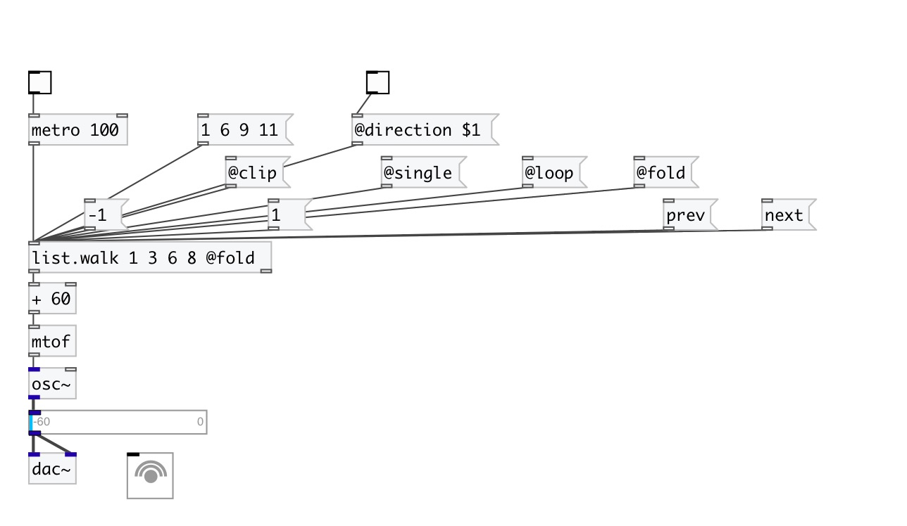

[< reference home](index.html)
---

# list.walk

Walks thru the list

---

Universal list walker. If you want to output current element and when move to next
            - use [1( message, Otherwise - use [next( if you want first move to next position and
            then output it.
 

---

---
arguments:

INIT: initial list 

---
properties:

@mode: pass
            mode. See properties below for detailed information. 
@clip: clipped pass mode. When the list bounds are reached
            - min/max value repeats perpetually. 
@single: single pass mode. When the list bounds are
            reached - no output any more until reset. 
@loop: @wrap alias 
@wrap: wrap pass mode. List values are repeated in a
            loop 
@fold: fold pass mode. List values are repeated in a loop
            with folding 
@direction: walking direction. &#34;1&#34; -
            forwards, &#34;0&#34; - backwards. 
@index: current
            position 
@length: output list
            length 
@size: current list
            size 
@value: current list 

---
see also: 

