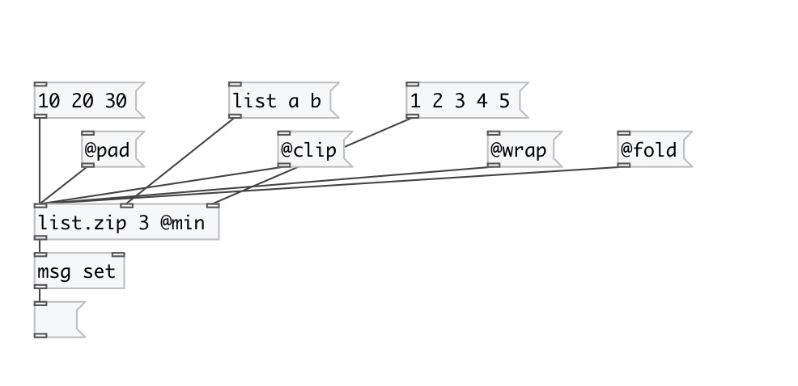

[< reference home](index.html)
---

# list.zip

takes n lists from n inlets (specified by argument) and output their
            elements sequentially (list1-1 list2-1 list1-2 list2-2 etc.).

---

 

---

---
arguments:

N: number of inputs 

---
properties:

@method: 
            behavior, if list have different sizes 
@min: alias for &#34;@oversize min&#34; property. Truncates lists
            to minimal common size 
@clip: alias for &#34;@oversize clip&#34; property. Pad shortest
            list with last element to conform longest list 
@wrap: alias for &#34;@oversize wrap&#34; property. Pad shortest
            list with repeated values from the beginning. 
@fold: alias for &#34;@oversize fold&#34; property. Pad shortest
            list with repeated values from the end to the beginning, then back and so
            on. 
@pad: pad value for pad method of
            resizing 
@l0: first list 
@l1: second list, etc. 

---
see also: 

