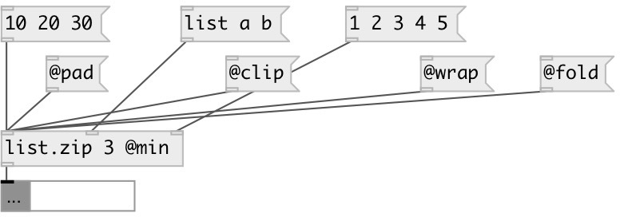

[index](index.html) :: [list](category_list.html)
---

# list.zip
**aliases:** [list.interleave]

###### takes n lists from n inlets (specified by argument) and output their elements sequentially (list1-1 list2-1 list1-2 list2-2 etc.).

*available since version:* 0.1

---

## arguments:

* **N**
number of inputs 
_type:_ int 

## properties:

* **@method** 
Get/set behavior, if list have different sizes 
_type:_ symbol 
_enum:_ min, pad, clip, wrap, fold 
_default:_ min 

* **@min** 
Get/set alias for &#34;@oversize min&#34; property. Truncates lists to minimal common size 
_type:_ alias 

* **@clip** 
Get/set alias for &#34;@oversize clip&#34; property. Pad shortest list with last element to
conform longest list 
_type:_ alias 

* **@wrap** 
Get/set alias for &#34;@oversize wrap&#34; property. Pad shortest list with repeated values
from the beginning. 
_type:_ alias 

* **@fold** 
Get/set alias for &#34;@oversize fold&#34; property. Pad shortest list with repeated values
from the end to the beginning, then back and so on. 
_type:_ alias 

* **@pad** 
Get/set pad value for pad method of resizing 
_type:_ atom 
_default:_ 0 

* **@n** (initonly)
Get/set number of inputs 
_type:_ int 
_range:_ 2..20 
_default:_ 2 

* **@lists** (readonly)
Get input data list: list of data:mlist 
_type:_ list 

## inlets:

* input list 
_type:_ control

## outlets:

* interleaved list 
_type:_ control

## keywords:

[list](keywords/list.html)
[functional](keywords/functional.html)

**See also:**
[\[list.unzip\]](list.unzip.html)

**Authors:** Alex Nadzharov, Serge Poltavsky

**License:** GPL3 or later

