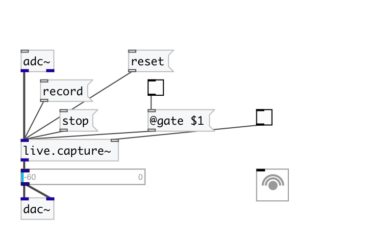

[< reference home](index.html)
---

# live.capture~

record up to 32s of sound and playback the recorded sound in
            loop

---

 

---

---
arguments:

---
properties:

@gate: start/stop
            recording 
@active: on/off dsp
            processing 

