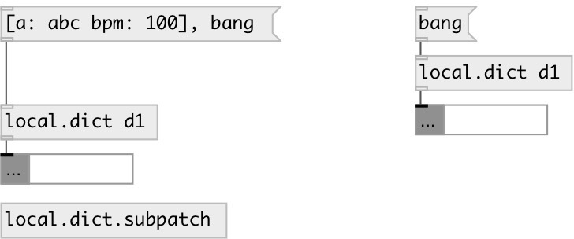

[index](index.html) :: [local](category_local.html)
---

# local.dict
**aliases:** [local.json]

###### local named dict object

*available since version:* 0.6

---

## information
Defines local scope dict variable, accessed by ID name and available only within its patch (canvas)

## arguments:

* **ID**
object ID 
_type:_ symbol 

## methods:

* **[....]**
sets new content without output 

* **add**
adds entry to dictionary 
  __parameters:__
  - **KEY** entry key 
    type: atom  
    required: True  

  - **VAL** single value or list 
    type: list  
    required: True  

* **choose**
choose random key and output it 

* **clear**
removes all dict values. No output 

* **get_key**
get entry from dictionary 
  __parameters:__
  - **KEY** entry key 
    type: atom  
    required: True  

* **read**
read dict from JSON file 
  __parameters:__
  - **PATH** file path 
    type: symbol  
    required: True  

* **remove**
remove entry from dictionary 
  __parameters:__
  - **KEY** entry key 
    type: atom  
    required: True  

* **set**
set dict content without output 

* **set_key**
change entry in dictionary. If it&#39;s not exists, do nothing. 
  __parameters:__
  - **KEY** key 
    type: atom  
    required: True  

  - **VAL** single value or list 
    type: list  
    required: True  

* **write**
write dict as JSON file 
  __parameters:__
  - **PATH** file path 
    type: symbol  
    required: True  

## properties:

* **@id** (initonly)
Get/set local variable id 
_type:_ symbol 
_default:_ default 

* **@keys** (readonly)
Get keys of dictionary 
_type:_ list 

* **@empty** (readonly)
Get 1 if dict is empty, otherwise 0 
_type:_ bool 
_default:_ 1 

* **@size** (readonly)
Get number of entries in dictionary 
_type:_ int 
_min value:_ 0 
_default:_ 0 

## inlets:

* output current dictionary value 
_type:_ control

## outlets:

* dict output 
_type:_ control

## keywords:

[dict](keywords/dict.html)
[local](keywords/local.html)
[global](keywords/global.html)

**See also:**
[\[data.dict\]](data.dict.html)
[\[global.dict\]](global.dict.html)

**Authors:** Serge Poltavsky

**License:** GPL3 or later

