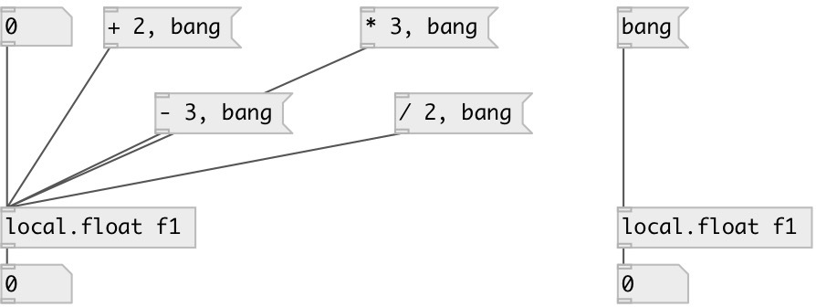

[index](index.html) :: [local](category_local.html)
---

# local.float

###### canvas-scoped named float variable

*available since version:* 0.1

---

## information
Defines named local float variable, accessed by name and available only within its patch (canvas). Note: it is not accessible even from subpatch.

## arguments:

* **ID**
object ID 
_type:_ symbol 

## methods:

* **set**
sets new value without output 

* **+**
add to float, no output 

* **-**
subtract from float, no output 

* *****
multiply to, no output 

* **/**
divide by, no output 

## properties:

* **@value** (readonly)
Get current value 
_type:_ float 
_default:_ 0 

## inlets:

* output value 
_type:_ control

## outlets:

* float output 
_type:_ control

## keywords:

[float](keywords/float.html)
[local](keywords/local.html)

**See also:**
[\[local.int\]](local.int.html)
[\[global.int\]](global.int.html)

**Authors:** Serge Poltavsky

**License:** GPL3 or later

